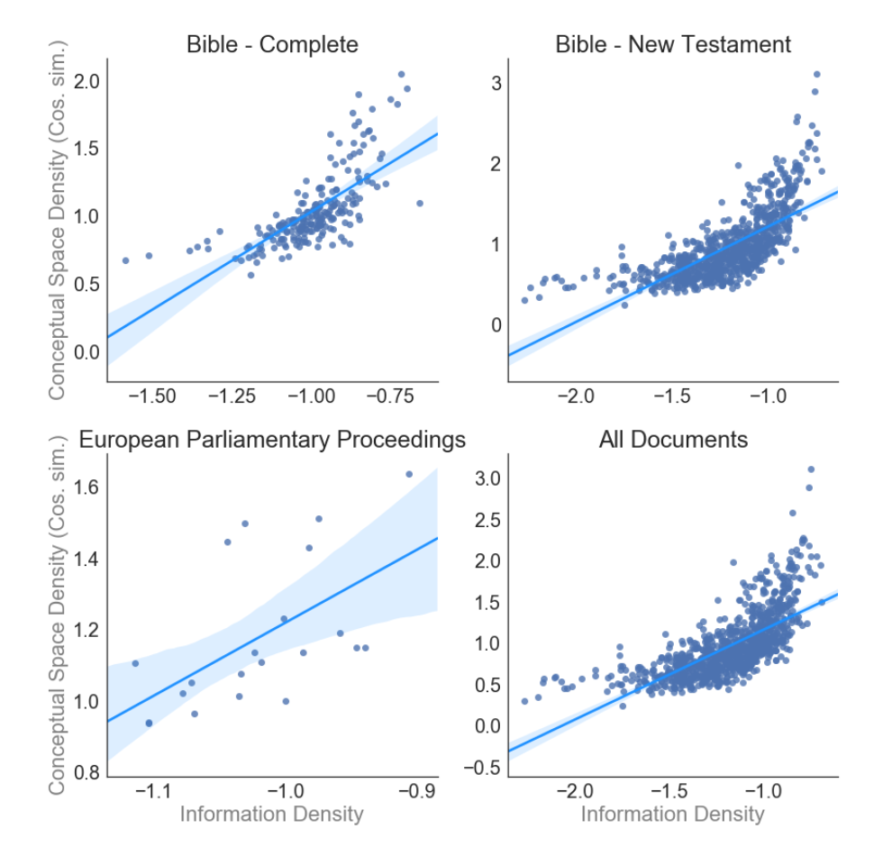
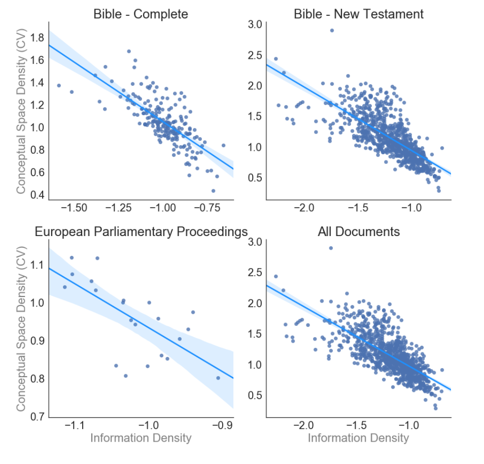

```{r setup, message = F, warning = F}
library(knitr)

opts_chunk$set(echo = T, message = F, warning = F, 
error = F, cache = F, tidy = F)

library(tidyverse)
library(corrplot)
library(feather)
library(broom)

theme_set(theme_classic(base_size = 10))
```


## Europarl vs. Bible pairwise distances
Comparision of pairwise distance measure using wikipedia fasttext models with bible and europarl words. Sample of 5000 bible and 1000 europarl words per language (varies by language).

```{r}
euro_dists <- read_csv("europarl_distance_summaries.csv", 
col_names = c("n_words", "empirical_mean", "ci_lower", 
"boot_mean", "ci_upper","median", "sd", "cv", "wiki_lang_code"))  %>%
select(wiki_lang_code, empirical_mean, cv) %>%
rename(europarl_mean = empirical_mean,
europarl_cv = cv)


bible_dists <- read_csv("bible_distance_5000_summaries.csv", 
col_names = c("n_words", "empirical_mean",
"sd", "cv", "wiki_lang_code"))  %>%
left_join(euro_dists)


bible_dists  %>%
filter(!is.na(europarl_mean)) %>%
ggplot(aes(x = empirical_mean, y = europarl_mean)) +
ylab("Europarl pairwise mean cosine distance") +
xlab("Bible pairwise mean cosine distance") +
geom_point() +
geom_smooth(method = "lm")
```

## Pairwise distances and rhsw 

### Europarl
```{r}
df <- read_csv("../../data/information_density_from_pete.csv") %>%
left_join(euro_dists, by = c(`639-1` = "wiki_lang_code")) %>%
select(74, 63, 77,78) %>%
filter(!`639-1` %in% c("vi", "yo"),
!is.na(europarl_mean))

ggplot(df, aes(x = rhsw, y = europarl_mean)) +
geom_label(aes(label = `639-1`)) +
ylab("pairwise mean cosine distance") +
geom_smooth(method = "lm") +
theme_classic()

ggplot(df, aes(x = rhsw, y = europarl_cv)) +
geom_label(aes(label = `639-1`)) +
ylab("pairwise coefficient of variation of cosine distance") +
geom_smooth(method = "lm") +
theme_classic()

```

### Bible{.tabset} 
#### All langs
```{r}
df <- read_csv("../../data/information_density_from_pete.csv") %>%
left_join(bible_dists, by = c(`639-1` = "wiki_lang_code")) %>%
select(74, 63, 77:81) %>%
filter(!is.na(empirical_mean)) %>%
filter(!`639-1` %in% c("vi", "yo"))

ggplot(df, aes(x = rhsw, y = empirical_mean)) +
geom_label(aes(label = `639-1`)) +
ylab("pairwise mean cosine distance") +
geom_smooth(method = "lm") +
theme_classic()


ggplot(df, aes(x = rhsw, y = cv)) +
geom_label(aes(label = `639-1`)) +
ylab("pairwise coefficient of variation of cosine distance") +
geom_smooth(method = "lm") +
theme_classic()

```

#### Excluding outliers
```{r}
df %>%
filter(!`639-1` %in% c("ja", "zh", "mr")) %>%
ggplot( aes(x = rhsw, y = empirical_mean)) +
geom_label(aes(label = `639-1`)) +
ylab("pairwise mean cosine distance") +
geom_smooth(method = "lm") +
theme_classic()


df %>%
filter( !( `639-1` %in% c("ja", "zh", "mr"))) %>%
ggplot(aes(x = rhsw, y = cv)) +
geom_label(aes(label = `639-1`)) +
ylab("pairwise coefficient of variation of cosine distance") +
geom_smooth(method = "lm") +
theme_classic()
```

#### Europarl langs only
```{r}
df %>%
filter(!is.na(europarl_mean)) %>%
ggplot( aes(x = rhsw, y = empirical_mean)) +
geom_label(aes(label = `639-1`)) +
ylab("pairwise mean cosine distance") +

geom_smooth(method = "lm") +
theme_classic()


df %>%
filter(!is.na(europarl_mean)) %>%
ggplot(aes(x = rhsw, y = cv)) +
geom_label(aes(label = `639-1`)) +
ylab("pairwise coefficient of variation of cosine distance") +
geom_smooth(method = "lm") +
theme_classic()

```

## Pete's data{.tabset}

(for comparision)

### Mean cosine distance (Fig. 2.3)

"Figure 2.3 shows that across all document types, there is a strong positive association between the information density of the words of a language and the density of the conceptual space. In line with expectations, more informationally dense languages tend to have denser conceptual spaces (All Documents: r = 0.7, p < 0.001). " (pg. 52)
```{r, out.width = "400px"}

```

### Coefficient of variation in cosine distance  (Fig. 2.4)

"To account for the possibility that cosine similarities are not comparable across documents, I measured the coefficient of variation for the distribution of the random word pair distances to normalize the cosine similarity parameter above. Here smaller values equate to denser distance distributions. Figure 2.4 shows consistent results across all document types (All Documents: r = -0.72, p < 0.001). To account for potential non-independence across language families, the above analysis was carried out by using the language family means instead of the language-level means. Results confirm the relationship (Cosine Similarity: r = 0.75, p < 0.001; Coefficient of Variation: r = -0.81, p < 0.001)." (pg. 53)
```{r, out.width = "400px"}

```

