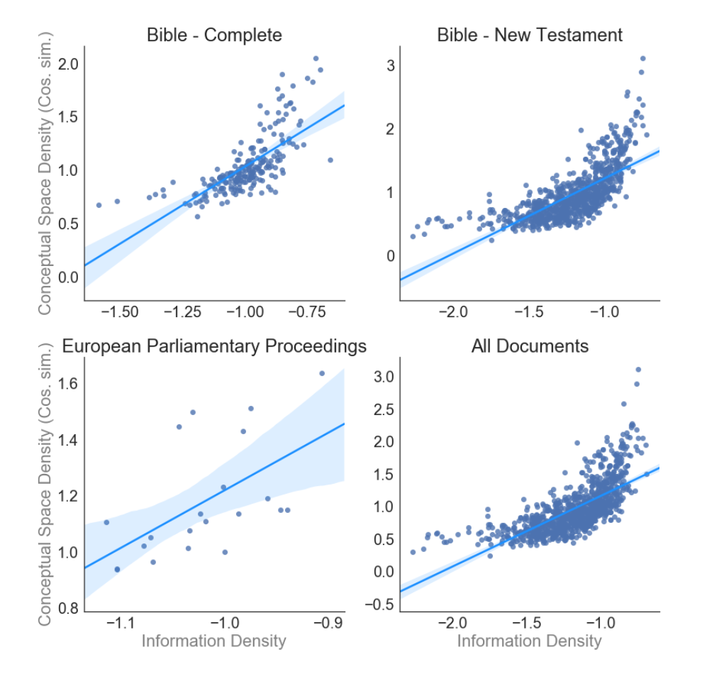
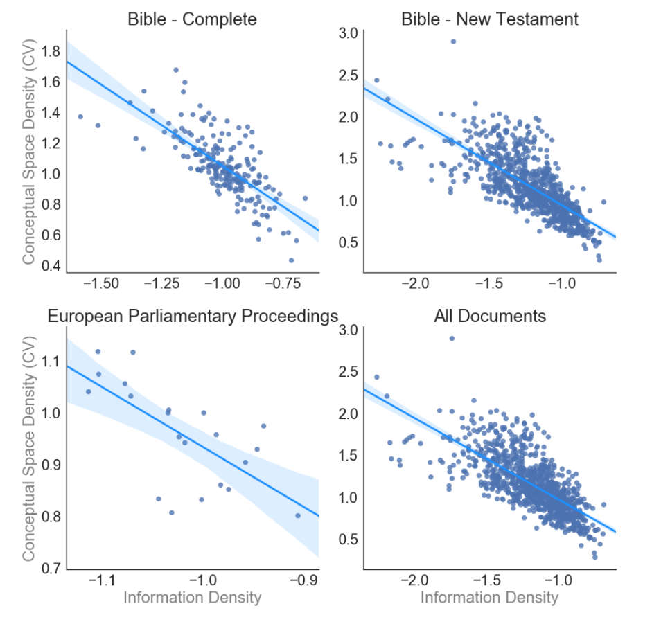

```{r setup, message = F, warning = F}
library(knitr)

opts_chunk$set(echo = T, message = F, warning = F, 
               error = F, cache = F, tidy = F)

library(tidyverse)
library(corrplot)
library(feather)
library(broom)
library(modelr)

theme_set(theme_classic(base_size = 10))
cols <- rev(colorRampPalette(c("red", "white", "blue"))(100))

```


## Pete's data{.tabset}

(for comparision)

### Mean cosine distance (Fig. 2.3)

"Figure 2.3 shows that across all document types, there is a strong positive association between the information density of the words of a language and the density of the conceptual space. In line with expectations, more informationally dense languages tend to have denser conceptual spaces (All Documents: r = 0.7, p < 0.001). " (pg. 52)
```{r, out.width = "400px"}

```

### Coefficient of variation in cosine distance  (Fig. 2.4)

"To account for the possibility that cosine similarities are not comparable across documents, I measured the coefficient of variation for the distribution of the random word pair distances to normalize the cosine similarity parameter above. Here smaller values equate to denser distance distributions. Figure 2.4 shows consistent results across all document types (All Documents: r = -0.72, p < 0.001). To account for potential non-independence across language families, the above analysis was carried out by using the language family means instead of the language-level means. Results confirm the relationship (Cosine Similarity: r = 0.75, p < 0.001; Coefficient of Variation: r = -0.81, p < 0.001)." (pg. 53)
```{r, out.width = "400px"}

```


## Replicating Pete's plots
Focusing only on mean distance.

```{r}
pete_data <- read_csv("../../data/information_density_from_pete2.csv") %>%
  select(`639-2-T`, `639-1`, avg_dist,  cv , rhsw, doc, vocab_size, word_count)
```

Mean dist
```{r, fig.height = 3}
pete_data %>%
  select(`639-2-T`, avg_dist, rhsw, doc) %>%
  gather("x", "doc", -`639-2-T`, -rhsw, -avg_dist) %>%
  select(-x) %>%
  ggplot(aes(x = rhsw, y = avg_dist)) +
  geom_point(size = .2) +
  geom_smooth(method = "lm") +
  facet_grid(.~doc) +
  theme_classic()
```

This replicates Pete's plots nicely.  Let's drop the `All documents` variable because it doesn't take the mean across documents from the same language (the same languages are represented mutliple times).

## Pairwise correlations {.tabset}

Let's look at the pairwise correlation between Huffman encoding ration (rhsw), mean distance, word count, and vocabulary size. They're all highly correlated.

### Europarl
```{r}
ALPHA <- .05
euro_corr <- 
  pete_data %>%
  mutate(log_word_count = log(word_count)) %>%
  filter(doc == "europarl") %>%
  select_if(is.numeric)


corr_mat <- cor(euro_corr, 
                use = "pairwise.complete.obs")

p.mat <- corrplot::cor.mtest(euro_corr, 
                  conf.level = (1-ALPHA),  
                  use = "pairwise.complete.obs")$p

corrplot::corrplot(corr_mat, method = "color",  col = cols,
         order = "original", number.cex = .7,
         addCoef.col = "black", 
         p.mat = p.mat, sig.level = ALPHA, insig = "blank", 
         tl.col = "black", tl.srt = 90,
         diag = FALSE)
```

### Bible New Testement
```{r}
nt_corr <- 
  pete_data %>%
  filter(doc == "bible_nt") %>%
  mutate(log_word_count = log(word_count)) %>%
  select_if(is.numeric)


corr_mat <- cor(nt_corr, 
                use = "pairwise.complete.obs")

p.mat <- corrplot::cor.mtest(nt_corr, 
                  conf.level = (1-ALPHA),  
                  use = "pairwise.complete.obs")$p

corrplot::corrplot(corr_mat, method = "color",  col = cols,
         order = "original", number.cex = .7,
         addCoef.col = "black", 
         p.mat = p.mat, sig.level = ALPHA, insig = "blank", 
         tl.col = "black", tl.srt = 90,
         diag = FALSE)
```

### Bible New Testement
```{r}
bible_full_corr <- 
  pete_data %>%
  filter(doc == "bible_full") %>%
    mutate(log_word_count = log(word_count)) %>%
  select_if(is.numeric)


corr_mat <- cor(bible_full_corr, 
                use = "pairwise.complete.obs")

p.mat <- corrplot::cor.mtest(bible_full_corr, 
                  conf.level = (1-ALPHA),  
                  use = "pairwise.complete.obs")$p

corrplot::corrplot(corr_mat, method = "color",  col = cols,
         order = "original", number.cex = .7,
         addCoef.col = "black", 
         p.mat = p.mat, sig.level = ALPHA, insig = "blank", 
         tl.col = "black", tl.srt = 90,
         diag = FALSE)
```


## Residualizing out word count{.tabset}

Let's see what happens when you residualize out word count - turns out it affects *both* mean distance and rhsw (excluding europarl).

### Europarl
```{r}
all_docs_df <- pete_data %>%
  filter(doc == "europarl") 

mod <- lm(rhsw ~ word_count,  all_docs_df)
mod2 <- lm(avg_dist ~ word_count,  all_docs_df)

all_docs_df2 <- all_docs_df %>%
  add_residuals(mod, "rhsw_resid") %>%
  add_residuals(mod2, "dist_resid")
  
all_docs_df2 %>%
  select(`639-2-T`, dist_resid, avg_dist, rhsw_resid, rhsw) %>%
  gather("measure", "rhsw_value", -`639-2-T`, -dist_resid, -avg_dist) %>%
  gather("dist_measure", "dist_value", -`639-2-T`, -measure, -rhsw_value) %>%
  ggplot(aes(x = rhsw_value, y = log(dist_value + 10))) +
  facet_grid(dist_measure ~ measure, scales = "free") +
  geom_point() +
  geom_smooth(method = "lm") +
  theme_classic()
```

### Bible New Testiment
```{r}
all_docs_df <- pete_data %>%
  filter(doc == "bible_nt") 

mod <- lm(rhsw ~ word_count,  all_docs_df)
mod2 <- lm(avg_dist ~  word_count,  all_docs_df)

all_docs_df2 <- all_docs_df %>%
  add_residuals(mod, "rhsw_resid") %>%
  add_residuals(mod2, "dist_resid")
  
all_docs_df2 %>%
  select(`639-2-T`, dist_resid, avg_dist, rhsw_resid, rhsw) %>%
  gather("measure", "rhsw_value", -`639-2-T`, -dist_resid, -avg_dist) %>%
  gather("dist_measure", "dist_value", -`639-2-T`, -measure, -rhsw_value) %>%
  ggplot(aes(x = rhsw_value, y = log(dist_value + 10))) +
  facet_grid(dist_measure ~ measure, scales = "free") +
  geom_point() +
  geom_smooth(method = "lm") +
  theme_classic()
```

### Bible full
```{r}
all_docs_df <- pete_data %>%
  filter(doc == "bible_full") 

mod <- lm(rhsw ~ word_count,  all_docs_df)
mod2 <- lm(avg_dist ~  word_count,  all_docs_df)

all_docs_df2 <- all_docs_df %>%
  add_residuals(mod, "rhsw_resid") %>%
  add_residuals(mod2, "dist_resid")
  
all_docs_df2 %>%
  select(`639-2-T`, dist_resid, avg_dist, rhsw_resid, rhsw) %>%
  gather("measure", "rhsw_value", -`639-2-T`, -dist_resid, -avg_dist) %>%
  gather("dist_measure", "dist_value", -`639-2-T`, -measure, -rhsw_value) %>%
  ggplot(aes(x = rhsw_value, y = log(dist_value + 10))) +
  facet_grid(dist_measure ~ measure, scales = "free") +
  geom_point() +
  geom_smooth(method = "lm") +
  theme_classic()
```

## Word count

Average distances is more correlated with log word count that rhsw. Maybe word count is a better measures of information density that rhsw.

```{r}
all_docs_df <- pete_data %>%
  filter(doc == "bible_nt") 

lm(rhsw~ word_count + vocab_size, all_docs_df) %>%
  summary()
```
Together, word count and vocab size account for 92% of the variability in rhsw (for the bible new testament, for example).

```{r, fig.height = 3}
pete_data %>%
  filter(doc != "All Documents") %>%
  select(`639-2-T`, avg_dist, word_count, doc) %>%
  gather("x", "doc", -`639-2-T`, -word_count, -avg_dist) %>%
  select(-x) %>%
  ggplot(aes(x = log(word_count), y = avg_dist)) +
  geom_point(size = .2) +
  geom_smooth(method = "lm") +
  facet_grid(.~doc) +
  theme_classic()
```

Since word count is correlated both with rhsw (Huffman encoding) and mean distance it means it will be difficult to compare them on different corpora where the information content isn't well matched across languages (like Wikipedia).
